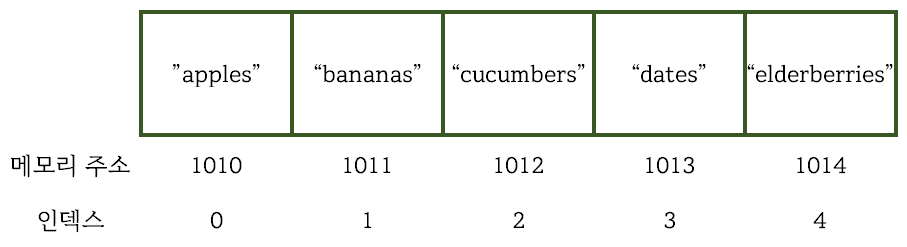

> 이 문서는 책 [누구나 자료 구조와 알고리즘](http://www.yes24.com/Product/Goods/61941073)을 읽고 요약한 글입니다.

# 1장 자료 구조가 중요한 까닭
- __데이터__: 모든 유형의 정보를 망라하는 용어
- 이 책의 목표: 단순히 데이터를 조직하는 방법이 아닌 __데이터 조직이 코드의 실행 속도에 미치는 영향__ 이 크다는 것을 가르치기 위함

## 1.1 배열: 기초 자료 구조
- __배열__: 컴퓨터 과학에서 기초적인 자료 구조

- 자료 구조의 4 가지 기본 연산
	- __읽기__: 자료 구조내 특정 위치 찾아보기
	- __검색__: 자료 구조 내에서 특정 값 찾기
	- __삽입__: 자료 구조에 새로운 값을 추가하기
	- __삭제__: 자료 구조에서 값을 제거하기
- 연산이 얼마나 빠른지 측정할 때에는 얼마나 많은 __단계(step)__ 가 필요한가를 따져야 한다.
- 연산의 속도 측정 ==  __시간 복잡도__ 측정
	- 속도 == 시간 복잡도, 효율성, 성능

## 1.2 읽기
- __배열__ 에서의 읽기: 배열 내 특정 인덱스에 어떤 값이 들어 있는지 찾아 보는 것
	- 딱 _한 단계_ 로 이루어짐
- 컴퓨터가 배열의 특정 인덱스에 있는 값을 한 번의 단계로 바로 갈 수 있는 이유
	1. 컴퓨터는 모든 메모리 주소에 한 번에 갈 수 있다.
	2. 각 배열에 저장된 내용은 메모리의 시작 주소이다.
	3. 배열의 인덱스는 0부터 시작한다.
- 컴퓨터가 인덱스 3에 있는 값을 읽는 과정
	1. 배열의 인덱스는 0부터 시작하고, 인덱스 0의 메모리 주소는 1010이다.
	2. 인덱스 3은 인덱스 0부터 세 칸 뒤에 있다.
	3. 따라서 인덱스 3을 찾으려면 1010 + 3인 메모리 1013으로 간다.

## 1.3 검색
- __배열__ 에서의 검색: 배열에 특정 값이 있는지 알아본 후, 있다면 어떤 인덱스에 있는지 찾는 것
- 컴퓨터가 배열에서 값을 찾는 과정
	- 인덱스 0부터 시작해서 값을 확인한 후 찾는 값이 아니면 다음 인덱스로 이동한다.
		- __선형 검색__
	- 선형 검색의 최대 단계 수: 셀의 개수 __N 단계__

## 1.4 삽입
- 배열에서 새 데이터를 삽입하는 연산은 __어디에__ 데이터를 삽입하는가에 따라 효율성이 다르다.
- 맨끝: 한 단계로 이루어짐
- __중간__: 삽입하려는 공간을 만들기 위해 뒤의 셀을 오른쪽으로 한 단계씩 옮겨야 한다.
- __처음__: 처음에 데이터를 삽입하면 오른쪽으로 옮겨야 하는 셀이 가장 많아진다.
	- __최악의 시나리오__

## 1.5 삭제
- 배열의 삭제: 특정 인덱스의 값을 제거하는 과정
	- 삽입과 비슷하지만 순서가 반대이다.
- 컴퓨터가 배열의 셀을 삭제하는 과정
	1. 배열에서 데이터 삭제
	2. 배열에 빈 칸이 생긴다.
	3. 배열은 빈 칸을 허용하지 않기 때문에 오른쪽에 있는 셀을 왼쪽으로 옮긴다.
- __최악의 시나리오__: 배열의 첫 번째 요소 삭제

## 1.6 집합: 단 하나의 규칙이 효율성을 바꾼다
- 집합: 중복 값을 __허용하지 않는다.__
- 집합은 삽입 연산을 하기 전에, __이 값이 이미 집합에 들어 있는지 결정해야 한다.__
	- 모든 삽입 연산에서 __검색 연산이 우선이다.__
	- 총 2N + 1 단계 (N은 배열의 크기)
- 배열보다 삽입 연산이 느리지만 중복 데이터가 없어야 할 때 유용하게 사용할 수 있다.

## 1.7 마무리
- 자료 구조의 성능 측정 핵심: __연산에 필요한 단계 수 구하기__