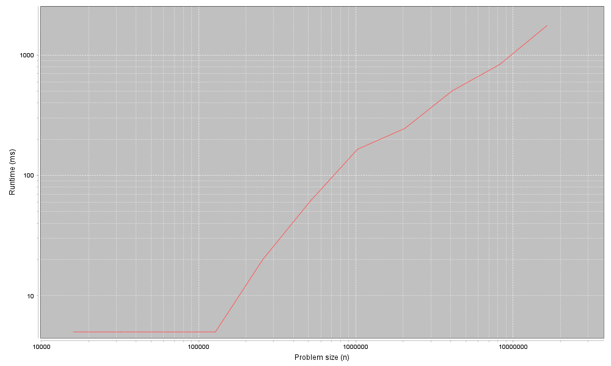
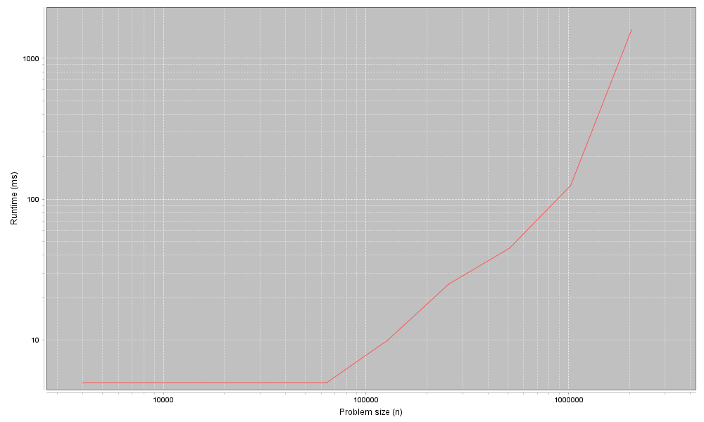
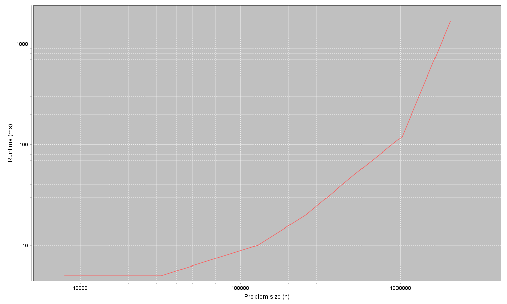

# 4장 LinkedList 클래스
## 4.1 MyLinkedList 메서드 분류하기
```java
/**
* 3장에서 작성한 LinkedList 메서드
*/
public int indexOf(Object target) {
    // 시작할 때, node는 head를 참조한다.
    Node node = head;
    // 각 루프에서 equals 메서드를 호출해서 target을 찾았는지 확인한다.
    for (int i = 0; i < size; i++) {
        if (equals(target, node.data)) {
            // target을 찾았다면 i를 즉시 반환하고,
            // 그렇지 않으면 리스트의 다음 노드로 넘어간다.
            return i;
        }
        node = node.next;
    }
    return -1;
}
/**
* 두 개의 인자를 가진 add 메서드 구현
*/
public void add(int index, E element) {
    // index가 0이라면 새로운 Node 객체를 시작에 추가한다.
    if (index == 0) {
        head = new Node(element, head);
    } else {
        // index가 0이 아니라면, 리스트를 순회한 후
        // index-1 위치에 있는 요소를 가져온다.
        Node node = getNode(index - 1);
        node.next = new Node(element, node.next);
    }
    size++;
}

/**
* index가 범위 안에 있는지 확인하는 getNode 메서드
*/
private Node getNode(int index) {
    // index가 범위 밖에 있다면 예외를 던진다.
    if(index < 0 || index >= size) {
        throw new IndexOutOfBoundsException();
    }
    // index가 범위 안에 있으면
    // 리스트를 순회하여 요청한 Node 객체를 반환한다.
    Node node = head;
    for (int i = 0; i < index; i++) {
        node = node.next;
    }
    return node;
}

/**
* index에 있는 요소를 제거하는 remove 메서드
*/
public E remove(int index) {
    E element = get(index);
    if(index == 0) {
        head = head.next;
    } else {
        Node node = getNode(index - 1);
        node.next = node.next.next;
    }
    size--;
    return element;
}
```

## 4.2 MyArrayList와 MyLinkedList 비교하기
구분 | MyArrayList|MyLinkedList
-------------|-----------|--------
add(끝)|1|n
add(시작)|n|1
add(일반적으로)|n|n
get/set|1|n
indexOf/lastIndexOf|n|n
isEmpty/size|1|1
remove(끝)|1|n
remove(시작)|n|1
remove(일반적으로)|n|n
- 어느 구현이 가장 나은지는 **가장 자주 사용하는 연산**으로 결정된다.

## 4.3 프로파일
- **Profile.java**: 문제 크기의 범위를 인자로 받아 실행하는 코드를 포함하며, 실행 시간을 측정하고 결과를 그래프에 출력한다.
```java
/**
* ArrayList의 끝에 새로운 요소를 추가하는 add 메서드의 실행 시간을 측정한다.
*/
public static void profileArrayListAddEnd() {
    // Timeable 인터페이스를 구현하고 동시에 새로운 클래스의 인스턴스를 생성한다.
    Timeable timeable = new Timeable() {
        List<String> list;
        
        public void setup(int n) {
            list = new ArrayList<String>();
        }
        
        public void timeMe(int n) {
            for (int i = 0; i < n ;i++) {
                list.add("a string");
            }
        }
    };
    
    String title = "ArrayList add end";
    // Timable 객체와 제목을 
    Profiler profiler = new Profiler(title, timeable);
    
    int startN = 4000;		// 시간 측정을 시작하는 n의 값
    int endMilis = 1000;	// 밀리 초 단위로 임계치(제한)을 지정한다.
    XYSeries series = profiler.timingLoop(startN, endMilis);
    profiler.plotResult(series);
}
```
### ProfileListAdd.java의 실행 결과


## 4.4 결과 해석하기
- add 메서드가 끝에 한 개의 요소를 추가할 때 상수 시간이 걸린다.
	- 따라서 n개의 요소를 추가하는 전체 시간은 선형이다.

## 4.5 실습 5
- **Profiler.java**: Profiler 클래스의 구현 코드를 담고 있다. 이번에 사용하기는 하지만, 어떻게 동작하는지 알 필요는 없다.
- **ProfileListAdd.java**: 앞 장의 예제를 포함한 실습 4의 시작 코드를 담고 있다. 이 파일을 수정해 다른 몇 개의 메서드를 프로파일할 것이다.
- 새로운 요소를 **ArrayList의 시작**에 추가할 때의 시간 측정 그래프

- 새로운 요소를 **ArrayList의 끝**에 추가할 때의 시간 측정 그래프

- 새로운 요소를 **LinkedLsit의 시작**에 추가할 때의 시간 측정 그래프

- 새로운 요소를 **LinkedList의 끝**에 추가할 때의 시간 측정 그래프


