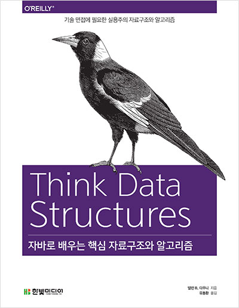

> 이 문서는 [자바로 배우는 핵심 자료구조와 알고리즘](http://www.yes24.com/Product/Goods/61198657)을 읽고 정리한 내용입니다.


# 5장 이중 연결 리스트
## 5.1 성능 프로파일 결과
```java
/**
* 4장에서 작성한 ProfileListAdd.java
* 결과 그래프의 기울기가 2에 가깝다.
* O(n) = n^2
*/
public static void profileArrayListAddBeginning() {
    Timeable timeable = new Timeable() {
    	List<String> list;
    
    	public void setup(int n) {
        	list = new Array<String>();
    	}
    
    	public void timeMe(int n) {
        	for (int i = 0; i < n; i++) {
            	list.add(0, "a string");
        	}
    	}
    };
    
    int startN = 4000;
    int endMillis = 1000;
    runProfiler("ArrayList add beginning", timeable, startN, endMillis);
}
```

## 5.2 LinkedList 메서드 프로파일하기
```java
/**
* 4장에서 작성한 ProfileListAdd.java
*/
public static void profileLinkedListAddBeginning() {
	Timeable timeable = new Timeable() {
		List<String> list;
        
        public void setup(int n) {
            list = new LinkedList<String>();
        }
        
        public void timeMe(int n) {
            for(int i = 0; i < n; i++) {
                list.add(0, "a string");
            }
        }
	};
    
    int startN = 128000;
    int endMillis = 2000;
    runProfiler("Linkedlist add beginning", timeable, startN, endMillis);
}
```

## 5.3 LinkedList 끝에 더하기
```java
/**
* 시작에 요소를 추가하는 연산을 LinkedList에 적용해 측정하는 메서드
*/
public static void profileLinkedListAddEnd() {
    Timeable timeable = new Timeable() {
        List<String> list;
        
        public void setup() {
            list = new LinkedList<String>();
        }
        
        public void timeMe() {
            for(int i = 0; i < n; i++) {
                list.add("a string");
            }
        }
    };
    
    int startN = 64000;
    int endMillis = 1000;
    runProfiler("LinkedList add end", timeable, startN, endMillis);
}
```

## 5.4 이중 연결 리스트
- 이중 연결 리스트의 특징
	- 각 노드는 다음 노드와 이전 노드에 대한 참조를 포함한다.
	- LinkedList 객체는 첫 번째와 마지막 요소에 대한 참조를 포함한다.
		- 따라서 리스트의 어느 한쪽 끝에서 시작하여 어느 방향으로든 순회할 수 있다.
- ArrayList, MyLinkedList(단일 연결), LinkedList(이중 연결) 클래스의 기대 성능 요약
구분|ArrayList|MyLinkedList|LinkedList
------|-------------|-------------------|---------------
add(끝)|1|n|1
add(시작)|n|1|1
add(일반적으로)|n|n|n
get/set|1|n|n
indexOf/lastIndexOf|n|n|n
isempty/size|1|1|1
remove(끝)|1|n|1
remove(시작)|n|1|1
remove(일반적으로)|n|n|n

## 5.5 자료구조 선택하기
- **알고리즘 분석**은 자료구조를 선택하는 지침을 제공하지만 다음의 조건을 고려해야 한다.
	1. 응용 프로그램의 실행 시간이 중요하다.
	2. 응용 프로그램의 실행 시간이 선택한 자료구조에 의존한다.
	3. 증가 차수에 따라 어느 자료구조가 나은지 실제로 예측할 수 있을 만큼 문제 크기가 충분히 크다.
