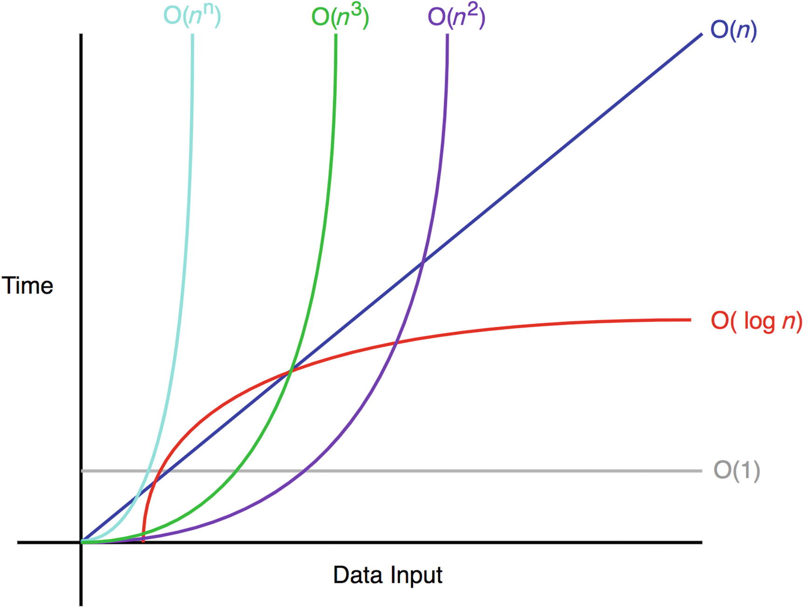

> 이 문서는 [자바로스크립트로하는 자료 구조와 알고리즘](http://www.yes24.com/Product/Goods/78165743) 을 보고 정리한 내용입니다.

# 1장 빅오 표기법
## 빅오 표기법 기초
* 빅오 표기법: 알고리즘의 최악의 경우 복잡도를 측정함 (=해당 알고리즘이 얼마나 효율적인지)
  * n: 입력의 개수
  * 빅오를 말로 풀어쓰면 **"*n*이 무한으로 접근할 때, 무슨 일이 일어날까?"**이다.

### 일반적인 예
* O(1): n에 영향을 받지 않음 (=상수 시간)
* O(*n*): 최악의 경우 n번의 연산을 수행함 (=선형 시간)
* O(*n^2*): 2차 시간
* O(*n^3*): 3차 시간
* O(log *n*): 로그 시간 복잡도, 입력이 클 때 효율이 가장 좋음

## 빅오 표기법 규칙
* **계수 법칙**: f(*n*)=O(g(*n*)) 은 k×f(*n*)=O(g(*n*)) (단, k > 0)
* **합의 법칙**: f(*n*)=O(h(*n*))이고, g(*n*)=O(p(*n*))이면, f(*n*)+g(*n*)=O(h(*n*)+p(*n*))이다.
* **곱의 법칙**: f(*n*)=O(h(*n*))이고, g(*n*)=O(p(*n*))이면, f(*n*)×g(*n*)=O(h(*n*)×p(*n*))이다.
* **전이 법칙**: f(*n*)=O(g(*n*))이고, g(*n*)=O(h(*n*))이면, f(*n*)=O(h(*n*))이다.
* **다항 법칙:** f(*n*)이 k차 다항식이면, f(*n*)=O(*n^k*)이다.

### 계수 법칙: "상수를 제거하라"
* n과 연관되지 않은 상수를 전부 무시하면됨
  * 예시 1: f(*n*)=*n* 과 f(*n*)=5*n*의 시간 복잡도는 둘 다 O(*n*)=n이다.
  * 예시 2: f(*n*)=*n*+1의 시간 복잡도는 O(*n*)=n이다.

### 합의 법칙: "빅오를 더하라"
*  시간 복잡도는 더할 수 있음
  * 예시: f(*n*)=*n*이고 g(*n*)=5*n*은 더할 수 있다. f(*n*)+g(*n*)의 결과는 6*n*이다. 또한 계수 법칙을 적용할 수 있기 때문에 최종적인 시간 복잡도는 O(*n*)=*n*이다.

### 곱의 법칙: "빅오를 곱하라"
* 시간 복잡도는 곱할 수 있음
  * 예시: f(*n*)=n이고, g(*n*)=5n은 곱할 수 있다. f(*n*)×g(*n*)의 결과는 5n^2이다. 또한 계수 법칙을 적용할 수 있기 때문에 최종적인 시간 복잡도는 O(*n^2*)이다.
### 다항 법칙: "빅오의 k승"
* 반복문이 중첩된 회수 = n의 차수
  * 예시: f(*n*)=n×n은 n^2이다. f(*n*)의 시간 복잡도는 f(*n*)이 2차 다항식이기 때문에, O(*n*^2)이다.

### 요약
* 계수 법칙: 계수/상수 제거하기
* 합의 법칙: 빅오 더하기
* 곱의 법칙: 빅오 곱하기
* 다항 법칙: 루프를 조사해 빅오 표기법의 다항 결정하기